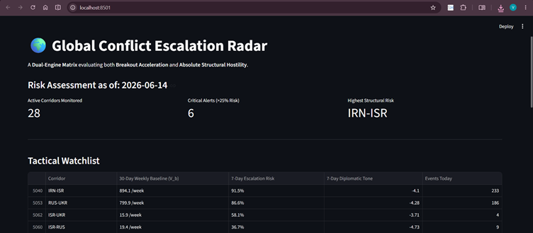
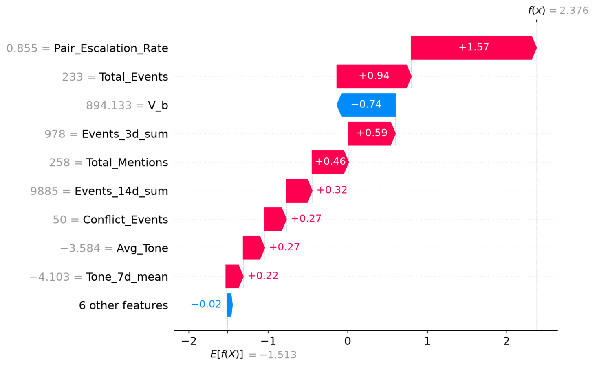

# 🌍 Global Conflict Escalation Predictor

**A Dual-Engine Machine Learning Radar for Forecasting Geopolitical Volatility**

The Global Conflict Escalation Predictor is an open-source Early Warning System (EWS). It transforms the chaotic, real-time stream of global news into a computable, structured machine learning pipeline to predict whether a specific geopolitical corridor (e.g., Russia-Ukraine, China-Taiwan) will experience a significant escalation in conflict over the next 7 days.

---

## 📖 What is GDELT?

This project is powered by the **Global Database of Events, Language, and Tone (GDELT)**. GDELT monitors global news media—spanning print, broadcast, and web in over 100 languages—and updates every 15 minutes. It uses natural language processing to extract quantifiable metrics from world events:

- **Event Volume**: How many actions are occurring.
- **Goldstein Scale**: A measure of diplomatic impact (cooperation vs. aggression).
- **Average Tone**: The emotional sentiment of the media narrative (-100 for extreme hostility to +100 for peace).

---

## 🛑 The Problem

Traditional geopolitical analysis relies on subjective expert opinion or static historical data. While GDELT provides high-resolution data, raw event volume is incredibly noisy.

Treating international relations as a computable time-series problem requires defining what "escalation" actually means. If we rely on simple math, the algorithm fails to distinguish between a sudden crisis in a historically peaceful region and a routine day in a saturated war zone.

---

## 🧠 The Evolution of the Mathematical Model

Building this system required navigating a deep statistical paradox. Here is how the target definition evolved to correctly map empirical geopolitical reality.

### Version 1: The Rolling Anomaly Trap (The Failed Approach)

**The Idea:**  
Define an escalation as any future 7-day volume that exceeds the pair's rolling 30-day mean plus two standard deviations ($\mu_{30} + 2\sigma_{30}$).

**The Flaw ("The Saturation Myth"):**  
This relative logic completely broke down in the real world. A steady-state war zone like Russia-Ukraine had such a massive, consistent baseline that generating a $+2\sigma$ statistical breakout became mathematically impossible. The model rated an active war as "Low Risk" (3.5%), while flagging minor 10-event jumps in quiet nations as "Massive Escalations." A 30-day rolling average acts as an information eraser—it accepts war as the "new normal."

### Version 2: The Dual-Engine Matrix (The Final Solution)

To fix this, the system was re-architected into a **Two-Pillar Matrix**. A country pair is flagged for escalation if it triggers either of these two independent mathematical engines:

**Engine 1: Dampened Relative Breakout (For Volatile Corridors)**  
Monitors sudden, unnatural spikes in volume while filtering out low-level noise.

$$E_{breakout} = 1 \text{ if } \frac{V_f - V_b}{V_b + \alpha_{global}} > 0.40$$

By using a global median dampener ($\alpha_{global} \approx 30$), trivial jumps (e.g., 0 to 11 events) are suppressed, but true narrative breakouts (e.g., China-Taiwan) trigger the alarm.

**Engine 2: Absolute Hostility Floor (For Saturated Wars)**  
Completely ignores rolling baselines to catch maxed-out, saturated conflicts.

$$E_{hostility} = 1 \text{ if } (V_f \ge V_{critical}) \text{ AND } (T_f \le T_{critical})$$

If a pair hits the top 75th percentile of global weekly volume and drops below a critical sentiment tone (-4.0), it flags as a crisis immediately, regardless of its past.

**Empirical Backtest Results:**  
Upon implementing the Dual-Engine Matrix, the historical detection rate for Russia-Ukraine leapt from a mathematically broken 16.7% to a highly realistic 68.2%, while false alarms for quiet corridors dropped to 0%.

---

## ⚙️ How the AI Works

### XGBoost Classification

The core prediction engine is an **XGBoost Classifier**. XGBoost is a powerful gradient-boosted decision tree algorithm. Because we engineered clean, geometrically separated targets (Engine 1 vs. Engine 2), the XGBoost trees can beautifully learn conditional logic: *“If volume is low, look at 3-day momentum spikes; if volume is saturated, look at negative sentiment crashes.”*

### SHAP (SHapley Additive exPlanations)

To ensure the model is not a "black box," the dashboard integrates **SHAP values**. SHAP breaks down a prediction to show exactly which feature (e.g., a drop in 7-day tone, or a spike in mentions) pushed the risk higher or lower.



---

## 🧭 Operational Threat Matrix (Interpreting Results)

Because the model avoids artificial scaling weights, it outputs calibrated, real-world probabilities. Use this translation layer to turn raw model percentages into tactical intelligence:

| Risk % | Operational Threat Tier | Core Mathematical Meaning | Real-World Context |
|--------|--------------------------|----------------------------|---------------------|
| < 15%  | Tier 1: Background / Cooling | Structurally quiet, or de‑escalating below baseline. | Safe/Stable. News volume dropping; calm rhetoric. |
| 15% – 35% | Tier 2: Simmering Volatility | Moderate friction building; minor diplomatic disputes. | Elevated Watch. Rhetoric souring, but no physical structural conflict yet. |
| 35% – 65% | Tier 3: Active Breakout Risk | Engine 1 is flashing. Sudden, abnormal hostility spikes. | High Alert. High probability of sudden diplomatic rupture or localized escalation. |
| > 65%  | Tier 4: Saturated Crisis | Engine 2 is engaged. Crossed absolute global limits. | Critical Threat. Sustained, high-intensity warfare certain to continue unabated. |

---

## 🏗️ System Architecture & Repository Structure

```text
Conflict-escalation-predictor/
│
├── README.md
├── requirements.txt
├── .gitignore
│
├── app/
│ └── 04_dashboard.py # Streamlit Web App (The UI/UX layer)
│
├── data/ # Ignored by Git (Data goes here)
│ ├── raw/ # Raw GDELT CSVs
│ └── processed/ # Engineered features & labels
│
├── models/ # Saved Machine Learning artifacts
│ ├── best_xgb_model.pkl # Trained XGBoost model
│ ├── feature_names.pkl # Feature map for SHAP
│ └── pair_stats.pkl # Saved structural context metrics
│
└── src/ # The Core Pipeline
├── 01_data_collection.py # Concurrent GDELT scraping
├── 02_feature_engineering.py # Rolling windows, Matrix Logic, Momentum
└── 03_model_training.py # XGBoost training & Time‑Series CV
```

---

## 🚀 Installation & Usage

### 1. Clone the Repository

```bash
git clone https://github.com/yourusername/conflict-escalation-predictor.git
cd conflict-escalation-predictor
```

### 2. Set up Python Environment
We recommend using Python 3.8 or higher with a virtual environment:

```bash
python -m venv venv
source venv/bin/activate       # On Windows: venv\Scripts\activate
```

### 3. Install Dependencies

```bash
pip install -r requirements.txt
```

### 4. Running the Pipeline
The system is built as a sequential pipeline. Run the scripts in order:

**Step A: Collect live data**
Fetches GDELT files and saves raw events.

```bash
python src/01_data_collection.py
```

**Step B: Engineer Features**
Applies the Dual-Engine Matrix and time‑series logic.

```bash
python src/02_feature_engineering.py
```

**Step C: Train the Model**
Trains XGBoost and saves artifacts.

```bash
python src/03_model_training.py
```

**Step D: Launch the Dashboard**
Start the interactive Streamlit UI to view live risk predictions and SHAP visualizations.

```bash
streamlit run app/04_dashboard.py
```

---

## 👨‍💻 Author
Vaibhav Jain
B.Tech, Production & Industrial Engineering
Indian Institute of Technology Delhi

Interested in the intersection of mathematical optimization, machine learning, and complex real‑world systems.
